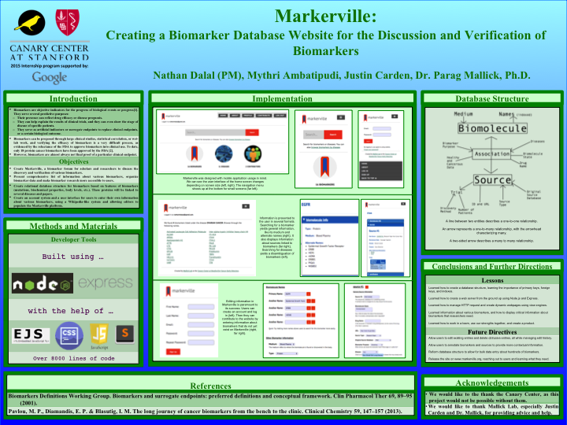

# Markerville

Code for website that displays information about biomarkers.
Allows users to search and edit existing information, while adding new entries of their own.
We aim to create a community around biomarkers in the clinical research world and beyond.

Developed by Mallick Lab at the Stanford Canary Center for Cancer Early Detection.
Built with Node.js, Express, and MySQL.

Thanks for viewing! More coming soon!

[Check out our poster!](poster)

